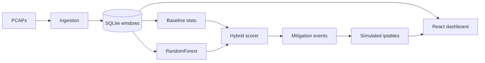

# Breakwater

Hybrid ML + statistical DDoS detector. It learns what normal traffic looks like, scores every second of a PCAP, classifies the attack type, and **proposes** firewall rules without executing them.



Built as a GUC Network Security course project by:

- [Abdelrahman Mohammed](https://github.com/Sherlemious)
- [Youssef Abdelaziz](https://github.com/yussefahmed)
- [Omar Yasser Abdelhalim](https://github.com/Omar-Goba)
- [Basant Abdalhamed](https://github.com/basantabdalhamed)

Live demo: [breakwater.sherlemious.com](https://breakwater.sherlemious.com) (recorded 20-minute pipeline run). Docker Compose still runs the full detector locally, then a React dashboard on `:8050`.

## What it does

1. **Ingest** — Stream PCAPs with Scapy into 1-second traffic windows (packet rate, byte rate, IP/port entropy, SYN ratio, protocol mix).
2. **Baseline** — Percentiles (p25 / p50 / p75) from benign training traffic.
3. **Detect** — Blend IQR feature scores (60%) with a RandomForest attack probability (40%, 200 trees). Classify volumetric, protocol, or application-layer attacks.
4. **Mitigate (simulated)** — Store `iptables` command strings, whitelist/blacklist, and graduated actions (alert → rate-limit → block). **Does not change the host firewall.**
5. **Dashboard** — React + Recharts UI over SQLite: scores, alerts, proposed rules, time navigation.

Mitigation rows are tagged `simulated; command stored but not executed`. Commands exist so a SOC demo can show *what* would be applied, not so this tool can lock you out of your own machine.

## Detection details

| Piece | Behaviour |
| --- | --- |
| Window size | 1 second (configurable) |
| Statistical score | Robust IQR distance from the benign median, weighted across rate / entropy / SYN / protocol features |
| RandomForest | `n_estimators=200`, `max_depth=12`, `class_weight=balanced`, trained only on labeled `dataset_split='train'` |
| Hybrid score | `0.60 * statistical + 0.40 * RF probability` |
| Attack types | volumetric · network_protocols · application_layer |

Mitigation policy (from the hybrid score, scaled 0–100):

| Level | Action |
| --- | --- |
| 0–30 | Alert only |
| 31–60 | Lenient rate limit (100 pkt/s) |
| 61–80 | Strict rate limit, or port block for protocol attacks |
| 81–100 | Temporary IP block (simulated) |

Whitelisted sources skip mitigation. Blacklisted sources get an immediate simulated block.

## Quick start

Requirements: Docker Desktop / Engine with Compose v2, plus four PCAPs in `pcaps/`.

```text
pcaps/benign-train.pcap
pcaps/attack-train.pcap
pcaps/benign-test.pcap
pcaps/attack-test.pcap
```

This repo does **not** ship packet captures. Use a public labeled set such as [CIC-DDoS2019](https://www.unb.ca/cic/datasets/ddos-2019.html) and split it into those four files.

```bash
docker compose --profile pipeline up --build --abort-on-container-exit --exit-code-from pipeline pipeline
docker compose --profile dashboard up --build dashboard
```

Open [http://localhost:8050](http://localhost:8050).

The public site at [breakwater.sherlemious.com](https://breakwater.sherlemious.com) is that same dashboard on a recorded snapshot — no PCAPs, no host firewall changes. Mitigation rows stay tagged `simulated; command stored but not executed`. If DNS is still propagating, the Vercel URL is [breakwater-psi.vercel.app](https://breakwater-psi.vercel.app).

Override filenames (paths are *inside* the container, under `/app/input`):

```bash
TRAIN_BENIGN_PCAP=/app/input/my-benign-train.pcap \
TRAIN_ATTACK_PCAP=/app/input/my-attack-train.pcap \
TEST_BENIGN_PCAP=/app/input/my-benign-test.pcap \
TEST_ATTACK_PCAP=/app/input/my-attack-test.pcap \
docker compose --profile pipeline up --build pipeline
```

## Layout

```text
ingestion/      PCAP parse, 1s windows, baseline, SQLite schema
model/          RandomForest train/score + hybrid statistical scorer
mitigation/     Simulated alerts, rate-limits, and iptables strings
pipeline/       One-shot Docker orchestration
dashboard/      Flask API + React (Recharts) UI
pcaps/          Your captures (gitignored, mount-only)
```

## Tests

```bash
PYTHONPATH=. pytest ingestion/tests model/tests mitigation/tests pipeline/tests
```

Individual services (debug profile):

```bash
docker compose --profile manual run --rm ingestion --help
docker compose --profile manual run --rm model train
docker compose --profile manual run --rm model score
docker compose --profile manual run --rm mitigation --help
```

## Stack

Python · Scapy · scikit-learn · SQLite · Docker · Flask · React · Recharts
